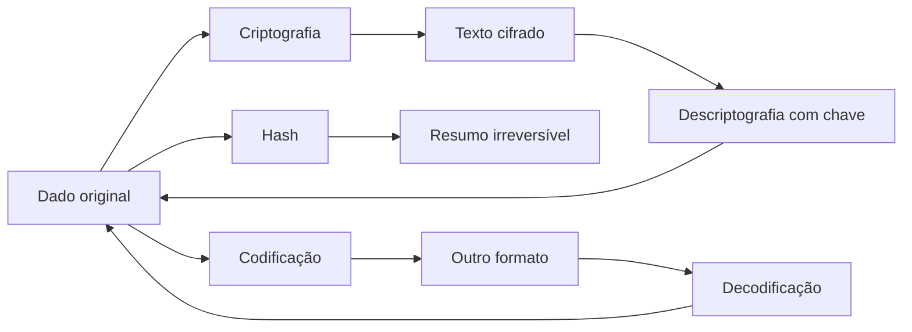

# Funções para Criptografia, Hash, Codificação e Proteção de Dados em PHP
**Integrantes:** Davi Bressan, Gustavo Bastos, Bianca Rocha, Kevin Nozaki.
**Curso:** 2°D

## Resumo

Este trabalho apresenta uma pesquisa sobre recursos da linguagem PHP utilizados para proteger informações em aplicações web. São abordados conceitos de segurança da informação, diferenças entre criptografia, hash e codificação, funções nativas do PHP para senhas, Base64, OpenSSL, prevenção de ataques e boas práticas de desenvolvimento seguro.

## 1. Segurança em aplicações web

Segurança da informação é o conjunto de práticas, controles e tecnologias usadas para preservar a confidencialidade, a integridade e a disponibilidade dos dados. Em uma aplicação web, isso significa impedir que informações de usuários sejam acessadas por pessoas não autorizadas, alteradas indevidamente ou deixem de estar disponíveis quando necessário.

Proteger dados dos usuários é importante por motivos técnicos, legais e éticos. Em sistemas reais, dados como nome, e-mail, senha, CPF, endereço, histórico de compras e informações financeiras podem causar danos quando vazados. A Autoridade Nacional de Proteção de Dados recomenda que organizações adotem medidas de segurança para proteger dados pessoais e reduzir riscos no tratamento dessas informações (ANPD, 2025). O CERT.br também destaca a importância de cuidados com contas, senhas, privacidade e proteção contra golpes na Internet (CERT.br, 2026).

Os principais riscos em aplicações desenvolvidas para a Internet incluem:

- roubo de senhas;
- vazamento de dados pessoais;
- SQL Injection;
- Cross-Site Scripting (XSS);
- Cross-Site Request Forgery (CSRF);
- sequestro de sessão;
- uso de bibliotecas ou versões desatualizadas;
- exposição de arquivos de configuração;
- falhas de validação de entrada;
- ausência de HTTPS.

No PHP, a segurança depende tanto dos recursos da linguagem quanto das decisões do desenvolvedor. A própria documentação oficial possui uma seção dedicada a segurança, incluindo segurança de banco de dados, dados enviados pelo usuário, sessões e manutenção da versão atualizada (PHP, 2026a).

## 2. Criptografia, hash e codificação

Criptografia, hash e codificação são conceitos diferentes. Eles podem parecer parecidos porque transformam dados, mas têm objetivos distintos.

| Conceito | O que faz | É reversível? | Exemplo de uso |
|---|---|---:|---|
| Criptografia | Transforma uma informação legível em texto cifrado usando uma chave | Sim, com a chave correta | Proteger dados sensíveis armazenados |
| Hash | Gera uma impressão digital de tamanho fixo a partir de um dado | Não | Armazenar senha de forma segura |
| Codificação | Converte dados para outro formato de representação | Sim | Enviar bytes binários em texto Base64 |

Criptografia deve ser usada quando a aplicação precisa recuperar o conteúdo original depois. Por exemplo, um sistema pode criptografar um token sensível antes de armazená-lo.

Hash deve ser usado quando não há necessidade de recuperar o valor original. Senhas são o principal exemplo: o sistema não precisa saber a senha em texto puro, apenas verificar se a senha digitada gera um resultado compatível com o hash armazenado. A OWASP recomenda armazenar senhas com algoritmos lentos e próprios para esse fim, como Argon2id, bcrypt ou PBKDF2, e nunca em texto puro (OWASP, 2026a).

Codificação é apenas uma mudança de formato. Base64, por exemplo, converte dados binários em caracteres de texto. Isso ajuda no transporte de dados, mas não oferece sigilo.

