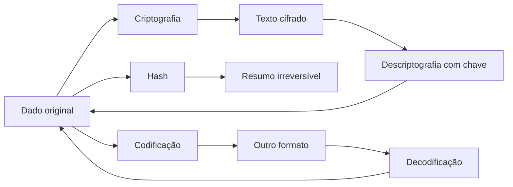

# Funções para Criptografia, Hash, Codificação e Proteção de Dados em PHP
**Integrantes:** Davi Bressan, Gustavo Bastos, Bianca Rocha, Kevin Nozaki.
**Curso:** 2°D

## Resumo

Este trabalho apresenta uma pesquisa sobre recursos da linguagem PHP utilizados para proteger informações em aplicações web. São abordados conceitos de segurança da informação, diferenças entre criptografia, hash e codificação, funções nativas do PHP para senhas, Base64, OpenSSL, prevenção de ataques e boas práticas de desenvolvimento seguro.

## 1. Segurança em aplicações web

Segurança da informação é o conjunto de práticas, controles e tecnologias usadas para preservar a confidencialidade, a integridade e a disponibilidade dos dados. Em uma aplicação web, isso significa impedir que informações de usuários sejam acessadas por pessoas não autorizadas, alteradas indevidamente ou deixem de estar disponíveis quando necessário.

Proteger dados dos usuários é importante por motivos técnicos, legais e éticos. Em sistemas reais, dados como nome, e-mail, senha, CPF, endereço, histórico de compras e informações financeiras podem causar danos quando vazados. A Autoridade Nacional de Proteção de Dados recomenda que organizações adotem medidas de segurança para proteger dados pessoais e reduzir riscos no tratamento dessas informações (ANPD, 2025). O CERT.br também destaca a importância de cuidados com contas, senhas, privacidade e proteção contra golpes na Internet (CERT.br, 2026).

Os principais riscos em aplicações desenvolvidas para a Internet incluem:

- roubo de senhas;
- vazamento de dados pessoais;
- SQL Injection;
- Cross-Site Scripting (XSS);
- Cross-Site Request Forgery (CSRF);
- sequestro de sessão;
- uso de bibliotecas ou versões desatualizadas; 
- exposição de arquivos de configuração;
- falhas de validação de entrada;
- ausência de HTTPS.

No PHP, a segurança depende tanto dos recursos da linguagem quanto das decisões do desenvolvedor. A própria documentação oficial possui uma seção dedicada a segurança, incluindo segurança de banco de dados, dados enviados pelo usuário, sessões e manutenção da versão atualizada (PHP, 2026a).

## 2. Criptografia, hash e codificação

Criptografia, hash e codificação são conceitos diferentes. Eles podem parecer parecidos porque transformam dados, mas têm objetivos distintos.

| Conceito | O que faz | É reversível? | Exemplo de uso |
|---|---|---:|---|
| Criptografia | Transforma uma informação legível em texto cifrado usando uma chave | Sim, com a chave correta | Proteger dados sensíveis armazenados |
| Hash | Gera uma impressão digital de tamanho fixo a partir de um dado | Não | Armazenar senha de forma segura |
| Codificação | Converte dados para outro formato de representação | Sim | Enviar bytes binários em texto Base64 |

Criptografia deve ser usada quando a aplicação precisa recuperar o conteúdo original depois. Por exemplo, um sistema pode criptografar um token sensível antes de armazená-lo.

Hash deve ser usado quando não há necessidade de recuperar o valor original. Senhas são o principal exemplo: o sistema não precisa saber a senha em texto puro, apenas verificar se a senha digitada gera um resultado compatível com o hash armazenado. A OWASP recomenda armazenar senhas com algoritmos lentos e próprios para esse fim, como Argon2id, bcrypt ou PBKDF2, e nunca em texto puro (OWASP, 2026a).

Codificação é apenas uma mudança de formato. Base64, por exemplo, converte dados binários em caracteres de texto. Isso ajuda no transporte de dados, mas não oferece sigilo.



## 3. Funções de hash no PHP

### `password_hash()`

A função `password_hash()` cria um hash de senha usando um algoritmo forte de mão única. Segundo a documentação oficial, ela inclui no próprio resultado as informações necessárias para verificação, como algoritmo, custo e salt (PHP, 2026b). Isso torna a função adequada para cadastro de usuários.

Exemplo:

```php
<?php
$senha = 'MinhaSenhaForte123!';
$hash = password_hash($senha, PASSWORD_DEFAULT);

echo $hash;
```

O `PASSWORD_DEFAULT` usa o algoritmo padrão definido pelo PHP. Atualmente, a documentação oficial informa que esse padrão é bcrypt, mas a constante foi criada para poder mudar no futuro quando algoritmos mais fortes forem adotados (PHP, 2026b). Por isso, recomenda-se reservar espaço suficiente no banco de dados, por exemplo `VARCHAR(255)`.

### `password_verify()`

A função `password_verify()` verifica se uma senha informada corresponde a um hash já armazenado. Ela é usada no login, comparando a senha digitada com o hash salvo no banco (PHP, 2026c).

Exemplo:

```php
<?php
$senhaDigitada = $_POST['senha'] ?? '';
$hashSalvo = '$2y$12$exemplo...'; // valor vindo do banco

if (password_verify($senhaDigitada, $hashSalvo)) {
    echo 'Login permitido';
} else {
    echo 'Senha inválida';
}
```

### `hash()`

A função `hash()` gera um resumo usando algoritmos como `sha256`, `sha512` e outros. Ela é útil para integridade de arquivos, assinaturas, comparação de dados e checksums, mas não deve ser a escolha principal para armazenar senhas de usuários, pois algoritmos rápidos como SHA-256 permitem muitas tentativas por segundo em ataques de força bruta (PHP, 2026d; OWASP, 2026a).

Exemplo de uso adequado:

```php
<?php
$conteudo = file_get_contents('arquivo.pdf');
$resumo = hash('sha256', $conteudo);

echo $resumo;
```

### Algoritmos recomendados atualmente

Para senhas, os algoritmos recomendados são os próprios para password hashing, especialmente `PASSWORD_ARGON2ID` quando disponível e bem configurado, ou `PASSWORD_DEFAULT`/bcrypt para compatibilidade com PHP. A OWASP recomenda Argon2id, bcrypt ou PBKDF2 para armazenamento de senhas (OWASP, 2026a). No PHP, `password_hash()` oferece suporte a `PASSWORD_BCRYPT`, `PASSWORD_ARGON2I` e `PASSWORD_ARGON2ID`, dependendo da compilação do ambiente (PHP, 2026b).

## 4. Funções de codificação

### `base64_encode()`

A função `base64_encode()` codifica uma string em Base64. Ela é usada quando dados binários precisam ser representados em texto, por exemplo ao embutir uma imagem pequena em JSON, transmitir bytes em APIs ou armazenar dados binários em um formato textual (PHP, 2026e).

Exemplo:

```php
<?php
$texto = 'Olá, mundo!';
$codificado = base64_encode($texto);

echo $codificado;
```

### `base64_decode()`

A função `base64_decode()` faz o processo inverso: recebe uma string em Base64 e retorna os dados originais (PHP, 2026f).

Exemplo:

```php
<?php
$codificado = 'T2zDoSwgbXVuZG8h';
$texto = base64_decode($codificado);

echo $texto;
```

### Por que Base64 não é criptografia

Base64 não é criptografia porque não usa chave secreta, não protege confidencialidade e pode ser revertido por qualquer pessoa. A finalidade é representar dados em um formato compatível com texto, não esconder informação. Portanto, nunca se deve usar Base64 para "proteger" senhas, tokens ou dados pessoais.

## 5. Criptografia no PHP com OpenSSL

OpenSSL é uma biblioteca de criptografia e comunicação segura. Segundo o projeto OpenSSL, ela é um toolkit robusto para criptografia de propósito geral e comunicação segura (OPENSSL, 2026). A documentação do OpenSSL também descreve o projeto como um conjunto de ferramentas que implementa SSL/TLS e padrões criptográficos relacionados (OPENSSL, 2025).

No PHP, a extensão OpenSSL permite usar funções de criptografia, descriptografia, assinatura, verificação de certificados e geração de dados aleatórios. Para criptografar e descriptografar informações, duas funções importantes são:

- `openssl_encrypt()`: criptografa dados;
- `openssl_decrypt()`: descriptografa dados.

Exemplo simplificado com AES-256-CBC:

```php
<?php
$metodo = 'aes-256-cbc';
$chave = random_bytes(32);
$iv = random_bytes(openssl_cipher_iv_length($metodo));

$texto = 'Informação sensível';
$cifrado = openssl_encrypt($texto, $metodo, $chave, OPENSSL_RAW_DATA, $iv);
$original = openssl_decrypt($cifrado, $metodo, $chave, OPENSSL_RAW_DATA, $iv);

echo $original;
```

Esse exemplo mostra o conceito, mas em produção é necessário armazenar a chave com segurança, usar IV aleatório, autenticar o texto cifrado quando o modo escolhido não faz isso automaticamente e evitar algoritmos antigos. Para novas aplicações, é preferível usar modos autenticados, como AES-GCM, quando disponíveis no ambiente.

## 6. Proteção de senhas

Senhas devem ser armazenadas como hashes fortes, lentos e com salt. O sistema não deve guardar a senha original, pois um vazamento de banco de dados exporia imediatamente todas as contas. Com `password_hash()`, o PHP gera automaticamente um salt seguro quando ele não é informado manualmente, e a documentação recomenda usar esse comportamento padrão (PHP, 2026b).

O salt é um valor aleatório combinado à senha antes ou durante o processo de hash. Ele impede que duas senhas iguais gerem resultados iguais e dificulta ataques com tabelas pré-computadas, como rainbow tables. A OWASP recomenda que cada senha tenha um salt único (OWASP, 2026a).

Um algoritmo de hash seguro para senhas precisa ter algumas características:

- ser de mão única;
- usar salt único;
- ser propositalmente lento;
- permitir ajuste de custo;
- resistir melhor a ataques com GPU e hardware especializado;
- ser amplamente analisado pela comunidade.

Fluxo correto para cadastro e login:

```mermaid
sequenceDiagram
    participant U as Usuário
    participant A as Aplicação PHP
    participant B as Banco de dados

    U->>A: Cria conta com senha
    A->>A: password_hash()
    A->>B: Salva apenas o hash
    U->>A: Tenta login
    A->>B: Busca hash salvo
    A->>A: password_verify()
    A-->>U: Acesso permitido ou negado

## 7. Proteção contra ataques

### SQL Injection

SQL Injection ocorre quando dados enviados pelo usuário são incorporados indevidamente em comandos SQL. Um atacante pode manipular a consulta para acessar, alterar ou apagar dados. A OWASP recomenda consultas parametrizadas como uma das principais defesas (OWASP, 2026b).

No PHP, deve-se usar PDO com prepared statements:

```php
<?php
$pdo = new PDO($dsn, $usuario, $senha);

$stmt = $pdo->prepare('SELECT * FROM usuarios WHERE email = :email');
$stmt->execute(['email' => $_POST['email']]);

$usuario = $stmt->fetch();
```

A documentação oficial do PHP explica que prepared statements separam os parâmetros dos comandos SQL, reduzindo o risco de injeção quando usados corretamente (PHP, 2026g).
